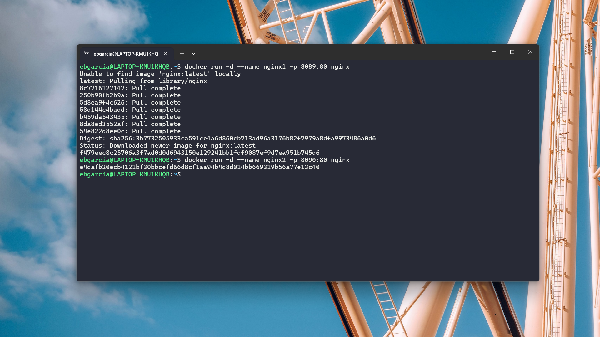
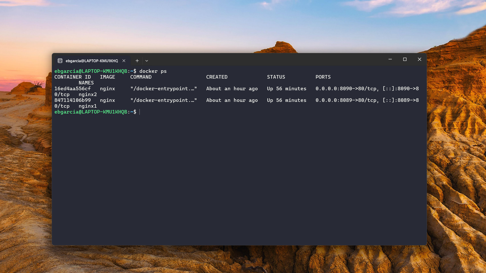
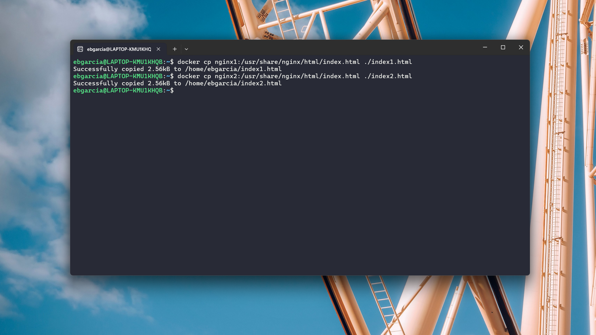
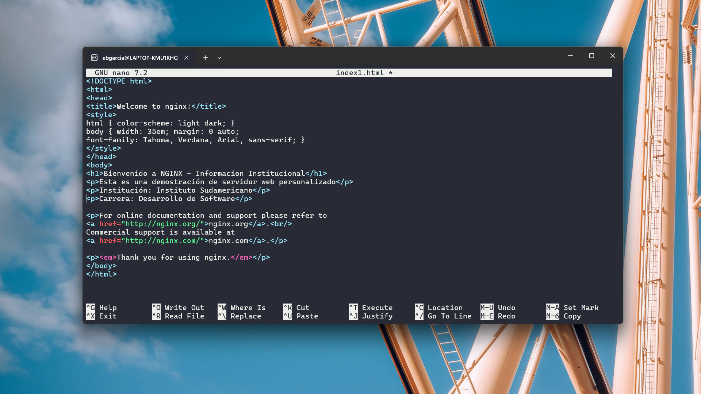
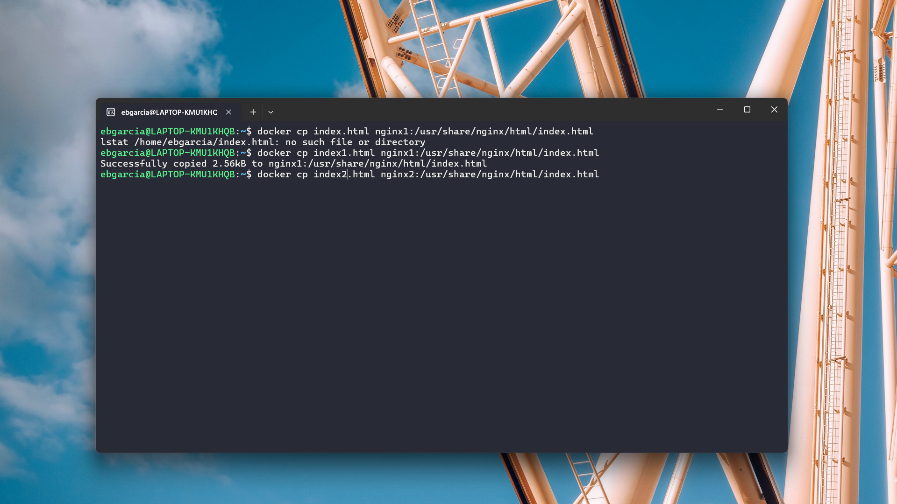
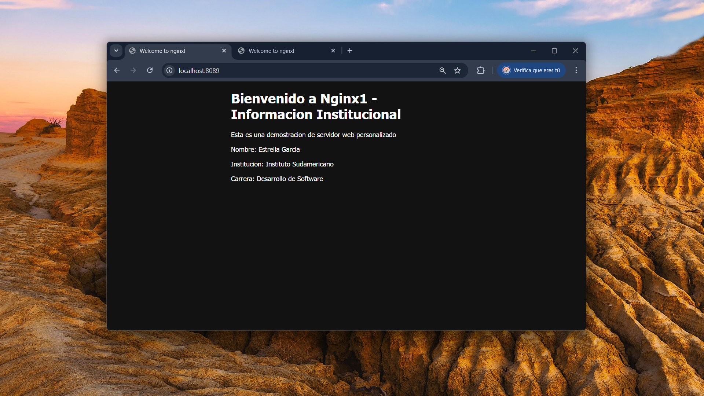
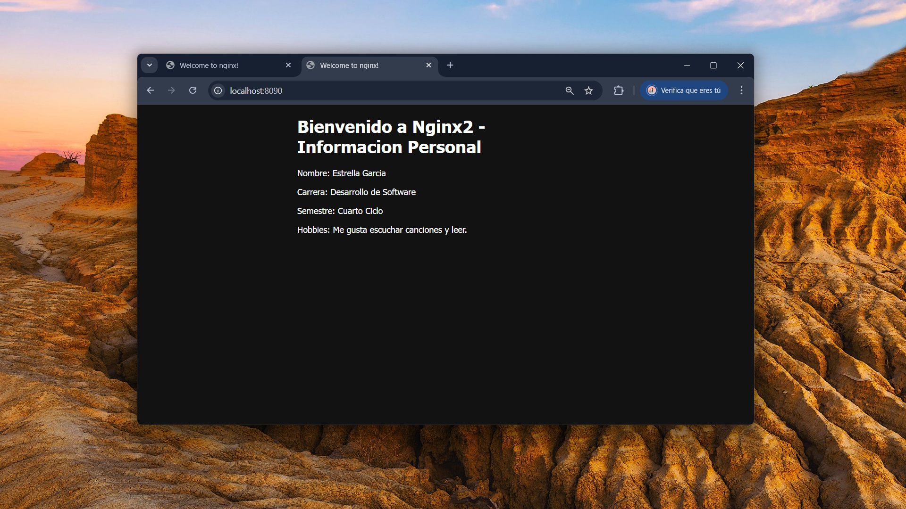

# **Práctica: Servidor Web con Contenedores Nginx**

## **1. Título**
**Contenedores Servidor Web con Docker y Nginx**

## **2. Tiempo de duración**
**Tiempo estimado:** 2 horas (120 minutos)

## **3. Fundamentos**

### **¿Qué es Docker?**
Docker es una plataforma abierta que permite desarrollar, enviar y ejecutar aplicaciones dentro de contenedores. Estos contenedores aíslan el entorno de ejecución, lo que facilita la portabilidad entre diferentes sistemas. Con Docker, se puede crear un entorno controlado donde el software se comporta de manera idéntica en desarrollo, pruebas y producción. Esta tecnología mejora la eficiencia, la escalabilidad y la velocidad del despliegue de aplicaciones, reduciendo los errores causados por configuraciones inconsistentes.

### **¿Qué es un contenedor?**
Un contenedor es una unidad ligera de software que agrupa código, librerías y dependencias necesarias para ejecutar una aplicación. A diferencia de las máquinas virtuales, los contenedores comparten el mismo sistema operativo del anfitrión, lo que los hace más eficientes en recursos y más rápidos al iniciarse. Cada contenedor actúa como un proceso independiente, garantizando aislamiento y seguridad entre aplicaciones.

### **¿Qué es NGINX?**
NGINX es un software de código abierto diseñado para ofrecer servicios web de alto rendimiento y estabilidad. Se utiliza principalmente como servidor HTTP, proxy inverso, balanceador de carga y servidor de caché. Su eficiencia lo convierte en una herramienta popular para gestionar grandes volúmenes de tráfico en sitios web y aplicaciones modernas.

### **NGINX con Docker**
Al ejecutar NGINX dentro de un contenedor Docker, se obtiene un servidor web completamente funcional y fácilmente desplegable en distintos entornos. Esta combinación permite crear, modificar y eliminar servidores de forma ágil sin afectar la configuración del sistema anfitrión. Además, facilita el desarrollo y las pruebas locales antes de implementar proyectos en producción.

<p align="right">
  
</p>

## **4. Conocimientos previos**

Para realizar esta práctica, el estudiante necesita tener claros los siguientes temas:

- Conocimientos básicos de **comandos Linux** (cd, ls, cp, nano, etc.)  
- **Manejo del navegador web** para acceder a los servicios desplegados  
- Comprensión general del **funcionamiento de puertos** en redes  
- Familiaridad básica con el **entorno de Docker**  
- Conocimiento sobre la **estructura de archivos HTML**

## **5. Objetivos a alcanzar**

- Implementar contenedores Docker con servidores web Nginx.  
- Manipular archivos de configuración y contenido web en contenedores.  
- Verificar la comunicación entre el contenedor y el sistema anfitrión.  
- Personalizar páginas web dentro de entornos contenerizados.  

## **6. Equipo necesario**

- Computador con sistema operativo **Windows, Linux o macOS**  
- **Docker Desktop** instalado (versión 24.x o superior)  
- Acceso a **terminal o línea de comandos**  
- Navegador web (Google Chrome, Firefox o Edge)  
- Conexión a internet estable  
- Cuenta en **Play with Docker** o instalación local de Docker  

## **7. Material de apoyo**

- Documentación oficial de Docker  
- Guía de la asignatura *Tendencias Actuales en Desarrollo de Software*  
- Cheat Sheet de comandos Linux  
- Imagen oficial de NGINX en Docker Hub  

## **8. Procedimiento**

### **Paso 1: Creación de Contenedores Nginx**

Se crean dos contenedores Nginx independientes, asignando diferentes puertos para su acceso desde el navegador.

```bash
docker run -d --name nginx1 -p 8089:80 nginx
docker run -d --name nginx2 -p 8090:80 nginx
````
<p align="left">
  
</p>

### **Paso 2: Verificación de Contenedores en Ejecución**

Comprobamos que ambos contenedores estén en ejecución con el comando:

```bash
docker ps
```

**Resultado esperado:** dos contenedores en estado “Up”.

<p align="left">
  
</p>

### **Paso 3: Personalización del Contenedores**

Copiar los archivos originales al sistema anfitrión:

```bash
docker cp nginx1:/usr/share/nginx/html/index.html ./index1.html
docker cp nginx2:/usr/share/nginx/html/index.html ./index2.html
```
<p align="left">
  
</p>

Edición de los archivos con la información requerida:

```bash
nano index1.html
nano index2.html
```


**Contenido modificado:**

```html
<!DOCTYPE html>
<html>
<head>
    <title>Información Institucional</title>
</head>
<body>
    <h1>Bienvenido a Nginx1 - Información Institucional</h1>
    <p>Esta es una demostración de servidor web personalizado.</p>
    <p>Nombre: Estrella García</p>
    <p>Institución: Instituto Sudamericano</p>
    <p>Carrera: Desarrollo de Software</p>
</body>
</html>
```
```html
<!DOCTYPE html>
<html>
<head>
    <title>Información Personal</title>
</head>
<body>
    <h1>Bienvenido a Nginx2 - Información Personal</h1>
    <p>Nombre: Estrella García</p>
    <p>Carrera: Desarrollo de Software</p>
    <p>Semestre: Cuarto Ciclo</p>
    <p>Hobbies: Me gusta escuchar canciones y leer.</p>
</body>
</html>
```
<p align="left">
  
</p>


Copia del archivo editado al contenedor:

```bash
docker cp index1.html nginx1:/usr/share/nginx/html/index.html
docker cp index2.html nginx2:/usr/share/nginx/html/index.html
```
<p align="left">
  
</p>

### **Paso 5: Verificación Final**

Reinicio de ambos contenedores:

```bash
docker restart nginx1 nginx2
```

Acceso a los servidores desde el navegador:

* **nginx1:** [http://localhost:8089](http://localhost:8089)
* **nginx2:** [http://localhost:8090](http://localhost:8090)

<div style="display: flex; justify-content: space-between;">
  
  
</div>

## **9. Resultados esperados**

Al finalizar la práctica se espera obtener dos servidores web funcionales ejecutándose en contenedores Nginx, cada uno con contenido HTML personalizado.
Los archivos se transfirieron correctamente entre el contenedor y el anfitrión, y los puertos configurados (8089 y 8090) permiten acceder a los sitios web desde el navegador.
Esto demuestra la capacidad de Docker para gestionar servicios aislados y reproducibles, así como la facilidad para personalizar configuraciones dentro de entornos contenerizados.

## **10. Bibliografía**

* Docker Inc. (2024). *What is a container?* [https://docs.docker.com/get-started/docker-concepts/the-basics/what-is-a-container/](https://docs.docker.com/get-started/docker-concepts/the-basics/what-is-a-container/)
* Docker Inc. (2024). *Docker Overview.* [https://docs.docker.com/get-started/docker-overview/](https://docs.docker.com/get-started/docker-overview/)
* Docker Hub. (2024). *NGINX Official Image.* [https://hub.docker.com/_/nginx](https://hub.docker.com/_/nginx)
* F5 Networks. (2023). *NGINX Glossary.* [https://www.f5.com/glossary/nginx](https://www.f5.com/glossary/nginx)
* Soka, J. (2019). *Docker: Imágenes y contenedores.* [https://soka.gitlab.io/blog/post/2019-07-08-docker-imagenes-y-contenedores/](https://soka.gitlab.io/blog/post/2019-07-08-docker-imagenes-y-contenedores/)
* Docker Inc. (2024). *How to use the official NGINX Docker image.* [https://www.docker.com/blog/how-to-use-the-official-nginx-docker-image/](https://www.docker.com/blog/how-to-use-the-official-nginx-docker-image/)

```